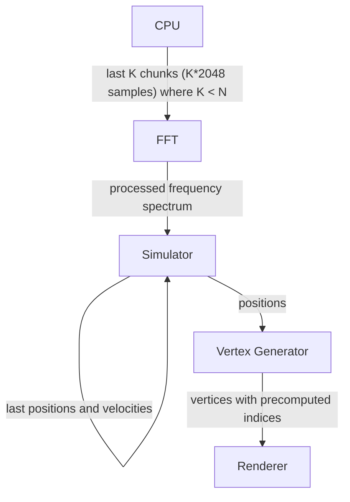

```mermaid
graph TD
    cpu[CPU]
    fft[FFT]
    sim[Simulator]
    vert[Vertex Generator]
    render[Renderer]

    cpu -->|"last K chunks (K*2048 samples) where K < N"| fft
    fft -->|processed frequency spectrum| sim
    sim -->|last positions and velocities| sim
    sim -->|positions| vert
    vert -->|vertices with precomputed indices| render
```